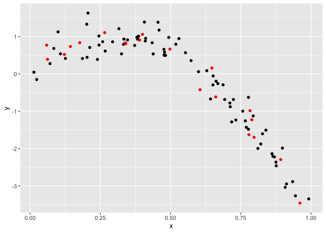

Cross Validation
================
Jessica Lavery
11/12/2019

``` r
# create a non-linear data frame
nonlin_df = 
  tibble(
    id = 1:100,
    x = runif(100, 0, 1),
    y = 1 - 10 * (x - .3) ^ 2 + rnorm(100, 0, .3)
  )

# look at the data frame
nonlin_df %>% 
  ggplot(aes(x = x, y = y)) + 
  geom_point() + theme_bw()
```

<!-- -->

``` r
# create training dataset with 80% of the original observations
# this works because there are 100 observations and we're explicitly choosing 80, sampling is based on n not %
train_df = sample_n(nonlin_df, 80)

# can also sample fraction to get 80%
train_df = sample_frac(nonlin_df, size = 0.8)

# select remaining 20% as the testing dataset
test_df = anti_join(nonlin_df, train_df, by = "id")

# plot to show which data elements are in the training and testing datasets
ggplot(train_df, aes(x = x, y = y)) + 
  geom_point() + 
  geom_point(data = test_df, color = "red")
```

<!-- -->

``` r
# run 3 models
linear_mod = lm(y ~ x, data = train_df)
smooth_mod = mgcv::gam(y ~ s(x), data = train_df)
wiggly_mod = mgcv::gam(y ~ s(x, k = 30), sp = 10e-6, data = train_df)

# look at smooth model
train_df %>% 
  add_predictions(smooth_mod) %>% 
  ggplot(aes(x = x, y = y)) + geom_point() + 
  geom_line(aes(y = pred), color = "red")
```

<!-- -->

``` r
# look at wiggly model
train_df %>% 
  add_predictions(wiggly_mod) %>% 
  ggplot(aes(x = x, y = y)) + geom_point() + 
  geom_line(aes(y = pred), color = "red")
```

<!-- -->

``` r
# look at all 3
train_df %>% 
  gather_predictions(linear_mod, smooth_mod, wiggly_mod) %>% 
  mutate(model = fct_inorder(model)) %>% 
  ggplot(aes(x = x, y = y)) + 
  geom_point() + 
  geom_line(aes(y = pred), color = "red") + 
  facet_wrap(~model)
```

<!-- -->

``` r
# compute root MSE
rmse(linear_mod, test_df)
```

    ## [1] 0.6856849

``` r
rmse(smooth_mod, test_df)
```

    ## [1] 0.2447032

``` r
rmse(wiggly_mod, test_df)
```

    ## [1] 0.3709693
