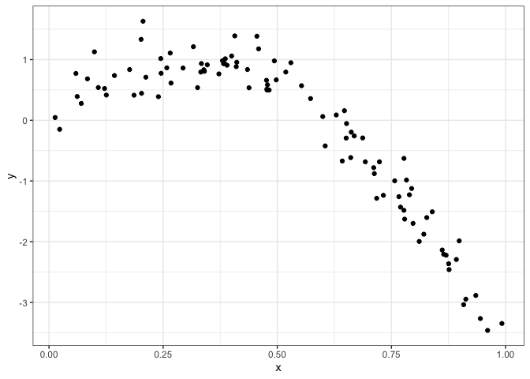

Cross Validation
================
Jessica Lavery
11/12/2019

``` r
# create a non-linear data frame
nonlin_df = 
  tibble(
    id = 1:100,
    x = runif(100, 0, 1),
    y = 1 - 10 * (x - .3) ^ 2 + rnorm(100, 0, .3)
  )

# look at the data frame
nonlin_df %>% 
  ggplot(aes(x = x, y = y)) + 
  geom_point() + theme_bw()
```

<!-- -->

``` r
# create training dataset with 80% of the original observations
# this works because there are 100 observations and we're explicitly choosing 80, sampling is based on n not %
train_df = sample_n(nonlin_df, 80)

# can also sample fraction to get 80%
train_df = sample_frac(nonlin_df, size = 0.8)

# select remaining 20% as the testing dataset
test_df = anti_join(nonlin_df, train_df, by = "id")

# plot to show which data elements are in the training and testing datasets
ggplot(train_df, aes(x = x, y = y)) + 
  geom_point() + 
  geom_point(data = test_df, color = "red")
```

<!-- -->

``` r
# run 3 models
linear_mod = lm(y ~ x, data = train_df)
smooth_mod = mgcv::gam(y ~ s(x), data = train_df)
wiggly_mod = mgcv::gam(y ~ s(x, k = 30), sp = 10e-6, data = train_df)

# look at smooth model
train_df %>% 
  add_predictions(smooth_mod) %>% 
  ggplot(aes(x = x, y = y)) + geom_point() + 
  geom_line(aes(y = pred), color = "red")
```

<!-- -->

``` r
# look at wiggly model
train_df %>% 
  add_predictions(wiggly_mod) %>% 
  ggplot(aes(x = x, y = y)) + geom_point() + 
  geom_line(aes(y = pred), color = "red")
```

<!-- -->

``` r
# look at all 3
train_df %>% 
  gather_predictions(linear_mod, smooth_mod, wiggly_mod) %>% 
  mutate(model = fct_inorder(model)) %>% 
  ggplot(aes(x = x, y = y)) + 
  geom_point() + 
  geom_line(aes(y = pred), color = "red") + 
  facet_wrap(~model)
```

<!-- -->

``` r
# compute root MSE
rmse(linear_mod, test_df)
```

    ## [1] 0.6856849

``` r
rmse(smooth_mod, test_df)
```

    ## [1] 0.2447032

``` r
rmse(wiggly_mod, test_df)
```

    ## [1] 0.3709693

In practice, it’s easiest to not have to do the training/testing split
by hand and to do the process more than one time. For that we can use
the `modelr` package.

``` r
# generate 100 training testing pairs and save into a dataframe
# id refers to the training/testing split
# train list column contains the training dataset for that iteration
cv_df = crossv_mc(nonlin_df, 100) 

# get the training dataframes out of cv_df
cv_df %>% 
  pull(train) %>% 
  .[[1]] %>% 
  as_tibble
```

    ## # A tibble: 79 x 3
    ##       id      x       y
    ##    <int>  <dbl>   <dbl>
    ##  1     1 0.266   1.11  
    ##  2     2 0.372   0.764 
    ##  3     3 0.573   0.358 
    ##  4     4 0.908  -3.04  
    ##  5     5 0.202   1.33  
    ##  6     6 0.898  -1.99  
    ##  7     8 0.661  -0.615 
    ##  8     9 0.629   0.0878
    ##  9    10 0.0618  0.392 
    ## 10    11 0.206   1.63  
    ## # … with 69 more rows

``` r
# get the testing dataframes out of cv_df
cv_df %>% 
  pull(test) %>% 
  .[[1]] %>% 
  as_tibble
```

    ## # A tibble: 21 x 3
    ##       id      x       y
    ##    <int>  <dbl>   <dbl>
    ##  1     7 0.945  -3.27  
    ##  2    14 0.384   0.938 
    ##  3    17 0.718  -1.29  
    ##  4    23 0.652  -0.0535
    ##  5    27 0.0134  0.0456
    ##  6    29 0.870  -2.22  
    ##  7    32 0.600   0.0620
    ##  8    37 0.794  -1.12  
    ##  9    47 0.0233 -0.148 
    ## 10    51 0.478   0.498 
    ## # … with 11 more rows

``` r
# repeat for all training and test datasets
# changes from storing each as a list to storing the entire dataset
cv_df = cv_df %>% 
  mutate(
    train = map(train, as_tibble),
    test = map(test, as_tibble))

# map to run the models and get the root MSE
cv_df = 
  cv_df %>% 
  mutate(linear_mod  = map(train, ~lm(y ~ x, data = .x)),
         smooth_mod  = map(train, ~mgcv::gam(y ~ s(x), data = .x)),
         wiggly_mod  = map(train, ~gam(y ~ s(x, k = 30), sp = 10e-6, data = .x))) %>% 
  mutate(rmse_linear = map2_dbl(linear_mod, test, ~rmse(model = .x, data = .y)),
         rmse_smooth = map2_dbl(smooth_mod, test, ~rmse(model = .x, data = .y)),
         rmse_wiggly = map2_dbl(wiggly_mod, test, ~rmse(model = .x, data = .y)))
```

Visualize this:

``` r
cv_df %>% 
  select(starts_with("rmse")) %>% 
  pivot_longer(
    everything(),
    names_to = "model", 
    values_to = "rmse",
    names_prefix = "rmse_") %>% 
  mutate(model = fct_inorder(model)) %>% 
  ggplot(aes(x = model, y = rmse)) + 
  geom_violin()
```

<!-- -->

## Example: Child growth

``` r
child_growth = read_csv("./data/nepalese_children.csv")
```

    ## Parsed with column specification:
    ## cols(
    ##   age = col_double(),
    ##   sex = col_double(),
    ##   weight = col_double(),
    ##   height = col_double(),
    ##   armc = col_double()
    ## )

``` r
child_growth %>% 
  ggplot(aes(x = weight, y = armc)) + 
  geom_point(alpha = .5)
```

<!-- -->

``` r
# add change point term
child_growth = child_growth %>% 
  mutate(weight_cp = (weight > 7) * (weight - 7))

# fit multiple models
linear_mod    = lm(armc ~ weight, data = child_growth)
pwl_mod    = lm(armc ~ weight + weight_cp, data = child_growth)
smooth_mod = gam(armc ~ s(weight), data = child_growth)

# plot all three model results
child_growth %>% 
  gather_predictions(linear_mod, pwl_mod, smooth_mod) %>% 
  mutate(model = fct_inorder(model)) %>% 
  ggplot(aes(x = weight, y = armc)) + 
  geom_point(alpha = .5) +
  geom_line(aes(y = pred), color = "red") + 
  facet_grid(~model)
```

<!-- -->

``` r
# cross-validate
cv_df <- crossv_mc(child_growth, 100) %>% 
  mutate(train = map(train, as_tibble),
         test = map(test, as_tibble))

cv_df = cv_df %>% 
  mutate(linear_mod  = map(train, ~lm(armc ~ weight, data = .x)),
         pwl_mod     = map(train, ~lm(armc ~ weight + weight_cp, data = .x)),
         smooth_mod  = map(train, ~gam(armc ~ s(weight), data = as_tibble(.x)))) %>% 
  mutate(rmse_linear = map2_dbl(linear_mod, test, ~rmse(model = .x, data = .y)),
         rmse_pwl    = map2_dbl(pwl_mod, test, ~rmse(model = .x, data = .y)),
         rmse_smooth = map2_dbl(smooth_mod, test, ~rmse(model = .x, data = .y)))

# plot the results
# smooth model provides best fit, MSE generally lower
# however, generally choose piecewise linear model over the smooth model b/c the interpretation is easier; here the difference in prediction error isn't large enough to move to smooth
cv_df %>% 
  select(starts_with("rmse")) %>% 
  pivot_longer(
    everything(),
    names_to = "model", 
    values_to = "rmse",
    names_prefix = "rmse_") %>% 
  mutate(model = fct_inorder(model)) %>% 
  ggplot(aes(x = model, y = rmse)) + 
  geom_violin()
```

<!-- -->
